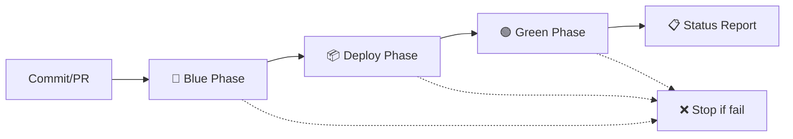

# 🔵🟢 Blue-Green Deployment CI/CD Pipeline

Este proyecto implementa una metodología **Blue-Green Deployment** completa para una aplicación Spring Boot con tests automatizados.

## 📋 Descripción de la Metodología

### 🔵 **Blue Phase (Pre-Deploy)**
- **Objetivo**: Validar que el código está listo para ser desplegado
- **Tests ejecutados**: Tests unitarios únicamente
- **Duración estimada**: ~2-3 minutos
- **Criterio de éxito**: Todos los tests unitarios deben pasar

### 📦 **Deploy Phase (Build & Package)**
- **Objetivo**: Construir el artefacto deployable
- **Acciones**: Compilación y empaquetado sin ejecutar tests
- **Duración estimada**: ~1-2 minutos
- **Criterio de éxito**: JAR construido exitosamente

### 🟢 **Green Phase (Post-Deploy)**
- **Objetivo**: Validar la aplicación desplegada en un entorno real
- **Tests ejecutados**: Tests de integración (Selenium)
- **Duración estimada**: ~3-5 minutos
- **Criterio de éxito**: Aplicación funciona correctamente end-to-end

## 🚀 Flujo de Ejecución



## 📁 Estructura de Perfiles Maven

### Profile: `unit-tests`
```xml
<exclude>**/SeleniumTest.java</exclude>
```
- Ejecuta todos los tests excepto Selenium
- Ideal para desarrollo rápido y validación básica

### Profile: `integration-tests`
```xml
<include>**/SeleniumTest.java</include>
```
- Ejecuta únicamente tests de Selenium
- Requiere aplicación corriendo

## 🛠️ Comandos Disponibles

### 🖥️ Testing Local

```bash
# Blue Phase - Tests unitarios
./mvnw test -Punit-tests

# Deploy Phase - Build sin tests
./mvnw clean package -DskipTests

# Green Phase - Tests de integración
./mvnw test -Pintegration-tests -Dheadless=true

# Blue-Green completo local
./test-blue-green.bat
```

### 🔧 Desarrollo

```bash
# Ejecutar aplicación
./mvnw spring-boot:run

# Tests en modo headless (para CI)
./mvnw test -Pintegration-tests -Dheadless=true

# Tests en modo visual (para desarrollo)
./mvnw test -Pintegration-tests
```

## ⚙️ Configuración de CI/CD

### Variables de Entorno

| Variable | Valor | Descripción |
|----------|-------|-------------|
| `CI` | `true` | Activa modo headless automáticamente |
| `DISPLAY` | `:99` | Display virtual para Selenium en Linux |

### Artefactos Generados

- **blue-phase-test-reports**: Reportes de tests unitarios
- **green-phase-test-reports**: Reportes de tests de integración
- **spring-boot-app**: JAR de la aplicación

## 📊 Ventajas de esta Implementación

### ✅ **Beneficios del Blue-Green Deployment**

1. **🔍 Detección temprana de errores**: Los tests unitarios (Blue) fallan rápido si hay problemas básicos
2. **⚡ Feedback rápido**: No esperas 5+ minutos para saber si hay errores simples
3. **🔧 Separación de responsabilidades**: Cada fase tiene un propósito específico
4. **💰 Optimización de recursos**: Solo se ejecutan tests costosos si lo básico funciona
5. **📈 Escalabilidad**: Fácil agregar más fases o tests específicos

### 🎯 **Mejores Prácticas Implementadas**

- **Fail Fast**: Los tests más rápidos se ejecutan primero
- **Artifact Reuse**: El JAR se construye una vez y se reutiliza
- **Environment Isolation**: Cada fase tiene su propio entorno limpio
- **Comprehensive Reporting**: Reportes separados por fase
- **Graceful Cleanup**: Aplicaciones se detienen correctamente

## 🔄 Estados de Deployment

| Estado | Blue | Deploy | Green | Acción |
|--------|------|--------|-------|--------|
| ✅✅✅ | PASS | PASS | PASS | Deploy exitoso |
| ❌⬜⬜ | FAIL | SKIP | SKIP | Fix código básico |
| ✅❌⬜ | PASS | FAIL | SKIP | Fix build/config |
| ✅✅❌ | PASS | PASS | FAIL | Fix tests e2e |

## 🚨 Troubleshooting

### Problemas Comunes

1. **Blue Phase falla**
   - Revisar tests unitarios en local
   - Verificar dependencias en `pom.xml`

2. **Deploy Phase falla**
   - Problemas de compilación
   - Dependencias faltantes

3. **Green Phase falla**
   - Chrome no instalado en CI
   - Aplicación no arranca correctamente
   - Tests de Selenium con timing issues

### Logs Útiles

```bash
# Ver logs del workflow
# GitHub Actions > Tu repo > Actions > Workflow run

# Ver logs locales
./test-blue-green.bat > deployment.log 2>&1
```

## 📚 Referencias

- [Blue-Green Deployment](https://martinfowler.com/bliki/BlueGreenDeployment.html)
- [GitHub Actions Documentation](https://docs.github.com/en/actions)
- [Maven Surefire Plugin](https://maven.apache.org/surefire/maven-surefire-plugin/)
- [Selenium WebDriver](https://selenium-python.readthedocs.io/)
